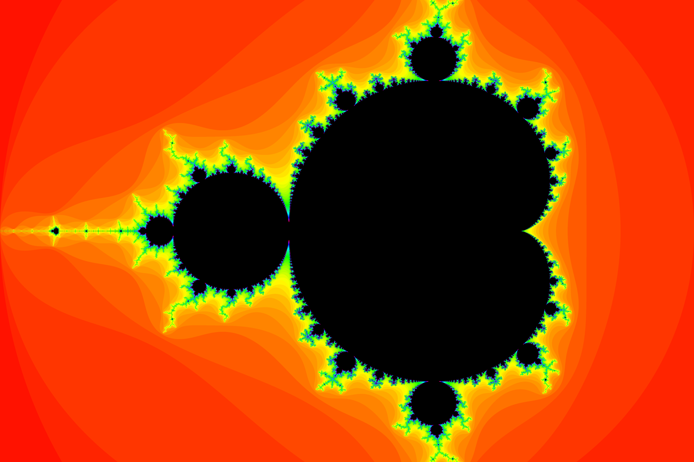
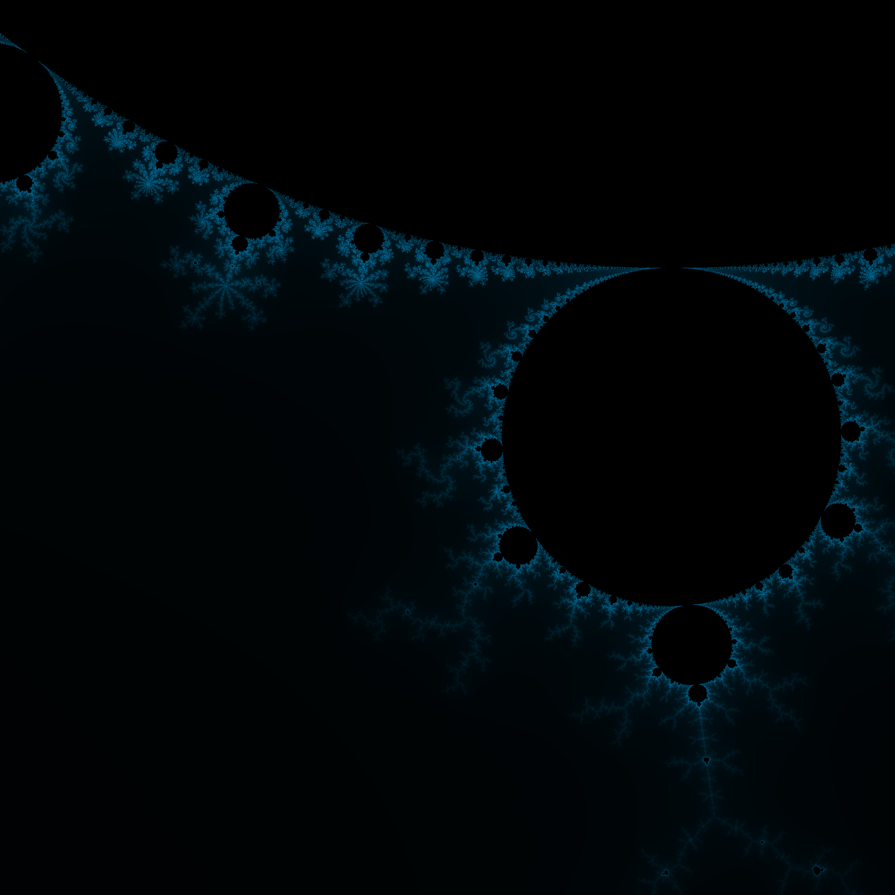

# fractals


Code written in IB HL Computer Science and IB HL Math for generating fractals.

I started working on this code for fun in IB CS, then decided to research fractals for my IB Math IA. After realizing that many other students were pursuing that topic, I switched my area of research to the lambda calculus (λ-calculus), so I migrated the code here.

You can find previous development history on my repositories [ibhlcs](https://github.com/ErikBoesen/ibhlcs/commits/master) in `programs/py/` and [ia_math](https://github.com/ErikBoesen/ia_math/commits/master) under `code/`.

## Usage
Render an image of the Mandelbrot Set fractal, saving to `/path/to/output_file.png` with image size of 600px:
```sh
python3 mandelbrot.py -o /path/to/output_file.png -s 600
```

## Author
[Erik Boesen](https://github.com/ErikBoesen)
